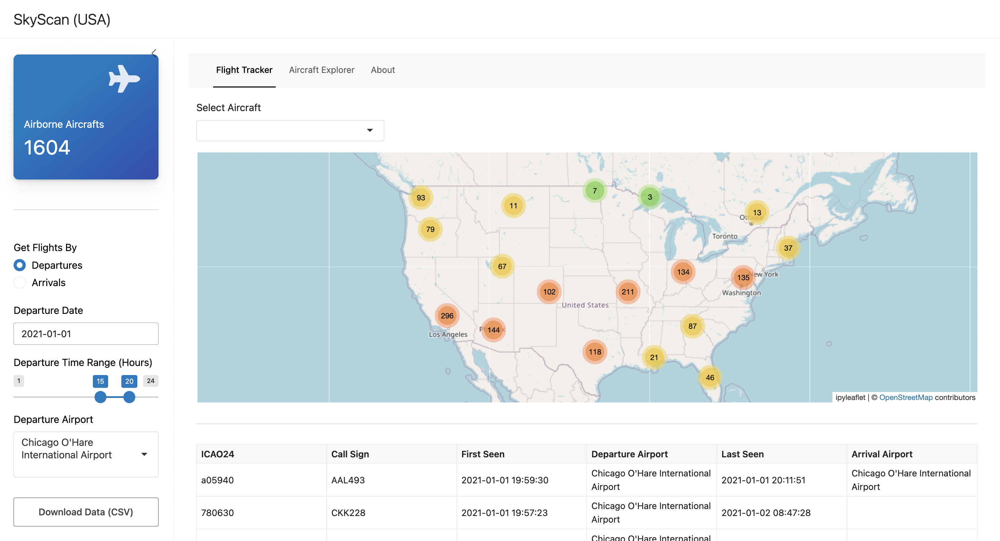
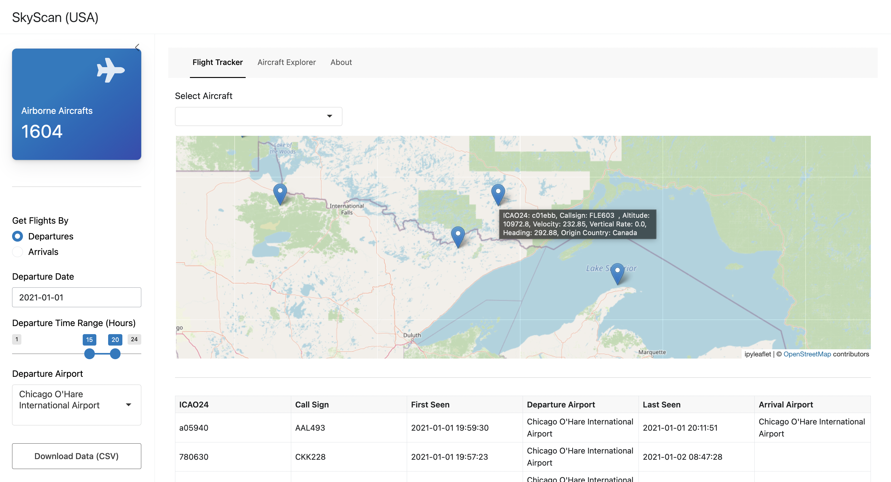
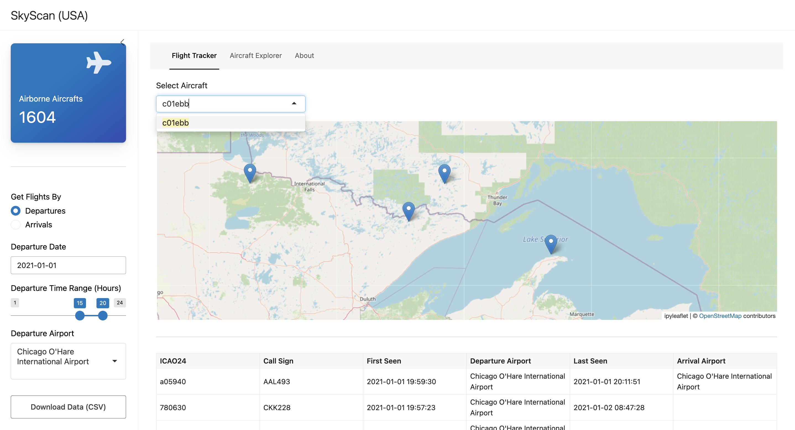
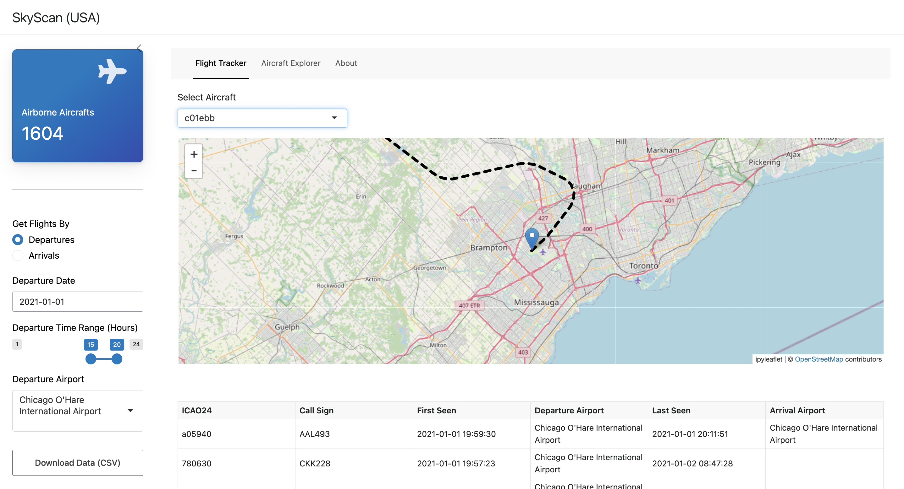
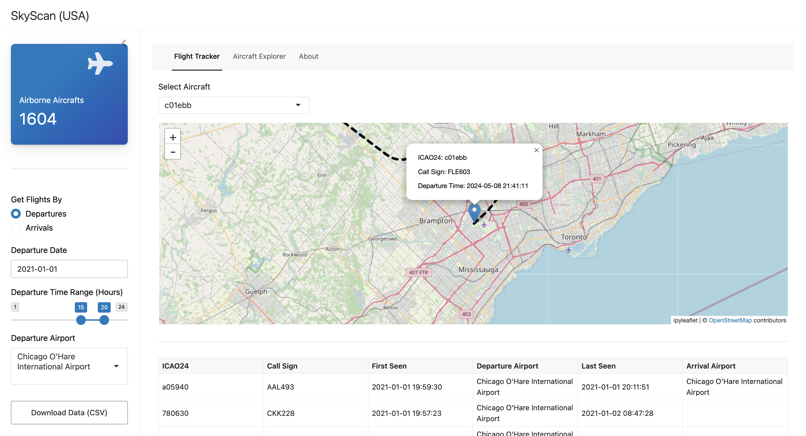
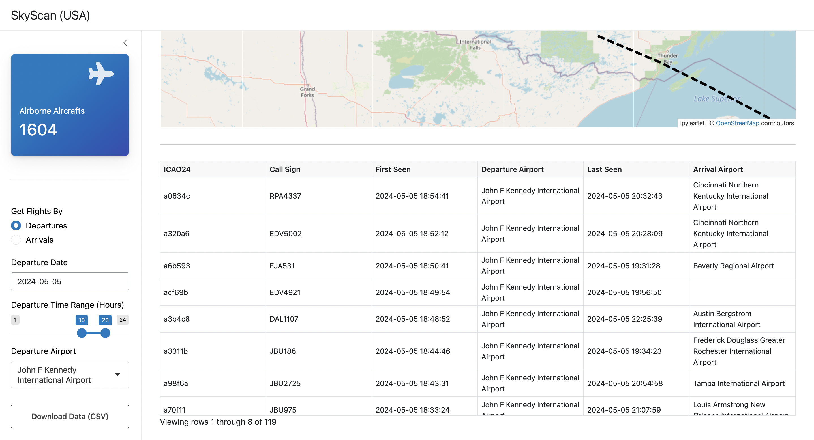
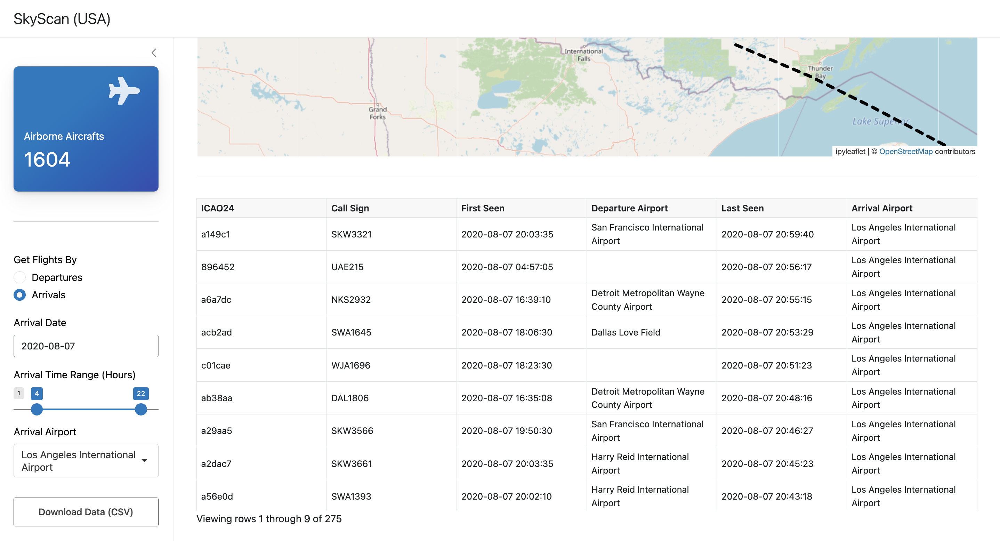
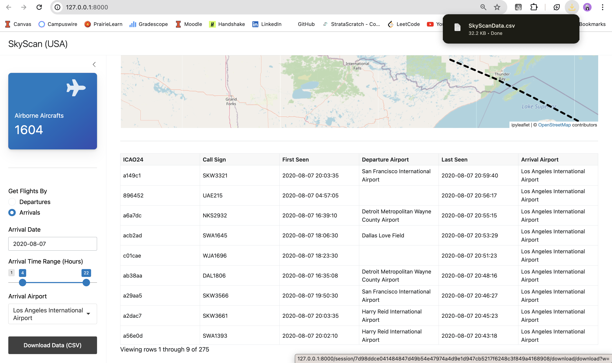
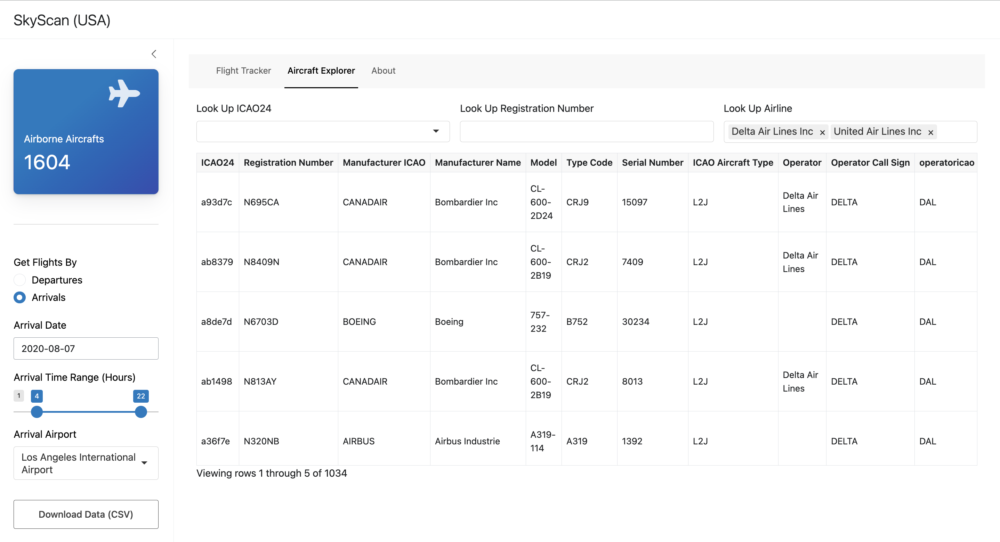

# SkyScan (USA)

### Statement Of P**urpose**

SkyScan USA is designed to provide real-time tracking of flights across the United States. This web app aims to serve travelers, aviation enthusiasts, and professionals in the airline and logistics industries by offering up-to-date information on flights. Despite the availability of a variety of flight tracking solutions, there are still challenges related to the integration of real-time data feeds and user-friendly access to this data. Thus, the primary goal of this web app is to provide a user-friendly and interactive tool aimed at facilitating easy exploration and collection of aviation data in an intuitive way.

### **Context**

Navigating the complexities of air travel requires access to precise and timely information. SkyScan leverages the [OpenSky Network API] (https://openskynetwork.github.io/opensky-api/rest.html),to deliver real-time flight tracking specifically for the U.S. aviation market. The app caters to a broad audience, from casual travelers to aviation enthusiasts, offering them a reliable tool to monitor flights and collect very detailed information about these US aircrafts.

In today's fast-paced world, the ability to access instant flight updates plays a crucial role in planning and operational efficiency. I built SkyScan primarily to fill a critical gap - which is access to both real-time and historical aviation data in an extremely user friendly way. The data collected from SkyScan can potentially be used to build various prediction systems to analyze aviation trends. Moreover, for professionals in the airline and logistics sectors, SkyScan can assist in managing and monitoring flights, thereby ensuring smooth operations. Thus, the app ensures accuracy and breadth of coverage, supporting the needs of a dynamic aviation environment.


Developed as a part of the coursework (Final Project) for [CS 498 : End to End Data Science](https://daviddalpiaz.github.io/cs498-sp24/final-project.html) at the University of Illinois Urbana-Champaign by Bhavana Sundar (bsundar3)

### Setup Instructions

The web app is built primarily using the Shiny library in Python and extensively leverages the [OpenSky Network API] (https://openskynetwork.github.io/opensky-api/rest.html), thus it would be ideal to familirize yourself with the API and its limitations before running the code. To run the code, the first step is to have Python 3.11 installed on your system. You can directly download and install Python from [python.org](https://www.python.org/).

Once you have Python installed, please clone this repository. You can then run the code by executing the following commands (from the root folder) in your terminal:

```

python3.11 -m pip install uv

uv venv

source .venv/bin/activate

uv pip install -r requirements.txt

shiny run --reload --launch-browser ./app.py

```

### Usage Examples

1. This is how the application landing page should look like. The main functionality is the live tracking of airbone flights over the US as visualized in the map. The KPI in the left sidebar gives you a total count of all aircrafts flying over USA in real-time.

   
   The different clustered numbers on the map indicate the number of airbone aircrafts (roughly) over that US state in real-time. By clicking one any of those ( I have clicked on 3 in this example ), you should be able to see the actual live location of these flights as shown below:

   
   By hovering over these markers, users can find detailed descriptions of the aircraft as shown in the screenshot. You can fetch the ICAO24 number by doing so to track a flight in real time as shown in the screenshots below.

   
   The select aircraft dropdown is a list of all airborne flights over the US in real-time. This feature helps you track the current status (location) of the flight. The example below shows the track for the aircraft with ICAO24 c01ebb.

   
   By clicking on this marker, you can find out when this flight departed and what the 'Call Sign' is. This information can (sometimes) be used to fetch further details from the Aircraft Explorer tab.

   
2. The next feature helps with collecting historic data. This can be done fetching data for flights by their 'departures' or 'arrivals'. The screenshot below shows all US flights that departed from the JFK airport on 5th of May 2024 between 3pm - 8pm CT. This data can be downloaded as a CSV file by clicking on the download button. 



Similarly, this screenshot shows all US flights that arrived at the LA airport on 7th of August 2020 between 4am - 10pm CT. 



The screenshot below shows how the data can be downloaded as a CSV file by clicking on the download button.



3. The aircraft explorer tab is fairly self explanatory. Information here is limited to only US aircrafts (all registration numbers starting from N) and the list of commercial airlines present as options for the Look Up Airline field.



Finally the about tab gives a high level summary and usage of the overall application.

**Note:** It is important to note that all data is fetched from the OpenSky Network API and is sucject to limitations imposed by the API. Thus, sometimes the application might not be able to render results as per requirements. It would be great if you could  lookup the restrictions and limitations of the API.
